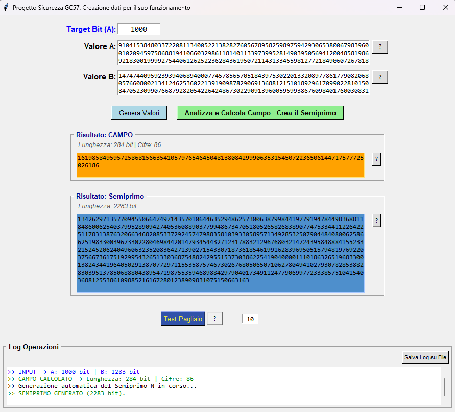
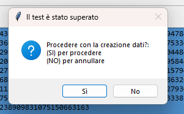
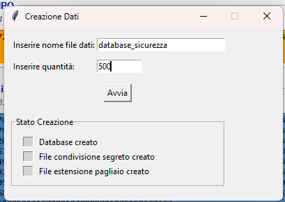
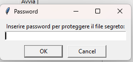
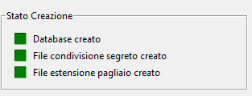
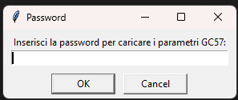
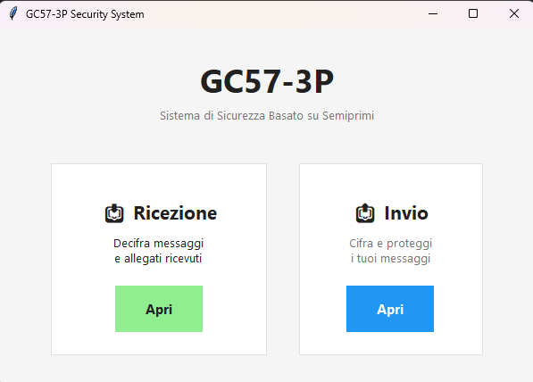
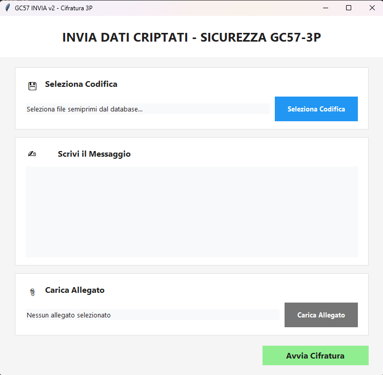
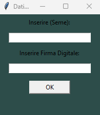
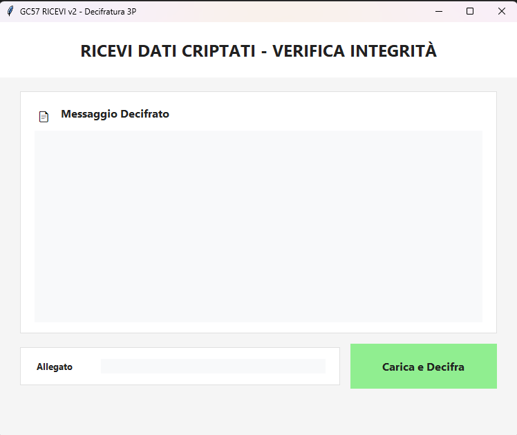

# Funzionamento del programma GC57-3P

## Introduzione

GC57-3P è un programma dimostrativo progettato per mostrare, in modo operativo, l’applicazione del metodo GC57 all’interno di un flusso completo di cifratura e decifratura.

Il sistema è strutturato come una sequenza di passaggi controllati, nei quali:
- vengono preparati i dati necessari al funzionamento;
- viene generato e analizzato un semiprimo;
- i suoi fattori vengono utilizzati per derivare una chiave crittografica;
- i dati vengono cifrati, trasferiti e successivamente verificati e decifrati.

Le schermate mostrate in questo documento corrispondono alle reali finestre operative del programma.

---

## 1. Preparazione dell’ambiente e creazione del database

All’avvio della procedura di preparazione, il programma consente la **creazione del database necessario al funzionamento del sistema GC57**.

In questa fase vengono definiti:
- i parametri di base per la generazione del semiprimo;
- il valore target (dimensione desiderata);
- i campi di lavoro utilizzati per i successivi calcoli.

Il programma esegue automaticamente:
- la generazione controllata del semiprimo;
- l’analisi dei suoi parametri numerici;
- la registrazione dei dati necessari al flusso GC57-3P.

Questa fase non richiede interventi manuali complessi e serve a predisporre l’ambiente operativo. 
L’unica operazione rilevante richiesta all’utente è l’inserimento di una **password**, utilizzata per la creazione e la protezione del file segreto.  
La password **non viene memorizzata in chiaro** né salvata all’interno del file: il sistema calcola esclusivamente **l’hash della password**, che viene utilizzato per i controlli successivi.

---

## 2. Prima esecuzione e configurazione delle cartelle

Quando GC57-3P viene eseguito per la prima volta (oppure quando il file di configurazione non è presente), il programma richiede la **configurazione delle cartelle di lavoro**.

L’utente deve indicare:
- la cartella di invio dei dati cifrati;
- la cartella di ricezione;
- la cartella degli allegati;
- la cartella contenente i semiprimi;
- il nome del supporto esterno utilizzato per le chiavi.

Questa configurazione viene salvata e riutilizzata nelle esecuzioni successive, evitando ripetizioni.

---

## 3. Caricamento dei parametri protetti

Dopo la configurazione, il sistema richiede l’inserimento di una **password**, necessaria per caricare i parametri GC57.

Questa fase separa:
- l’accesso all’ambiente operativo;
- dall’effettivo utilizzo del metodo.

Il caricamento corretto dei parametri tramite password consente al programma di procedere con le operazioni di cifratura e decifratura.

---

## 4. Fase di invio – Cifratura dei dati

Nel modulo di invio, l’utente può:
- inserire manualmente un testo oppure incollarlo;
- selezionare un file allegato;
- scegliere la codifica;
- avviare la procedura di cifratura.

Durante questa fase:
- il sistema utilizza il semiprimo selezionato;
- ne estrae i fattori tramite il metodo GC57;
- deriva la chiave crittografica;
-chiede di inserire un seme scelto liberamente e la propria firma

- cifra il contenuto e gli eventuali allegati.

Il risultato è un insieme di dati cifrati pronti per il trasferimento.

---

## 5. Fase di ricezione – Verifica e decifratura

Nel modulo di ricezione, il programma gestisce:
- richiesta password file segreti;
- il caricamento dei dati cifrati;
- la verifica dell’integrità per attestare un primo controllo umano;

- la decifratura del contenuto, se tutte le porte sono state aperte correttamente;
- il recupero degli allegati, se presenti.

La decifratura avviene solo se:
- i parametri sono corretti;
- il flusso GC57-3P viene rispettato;
- la chiave derivata coincide con quella attesa.

Questo passaggio conclude il ciclo operativo del sistema.

---

## Conclusione

GC57-3P dimostra come il metodo GC57 possa essere integrato in un flusso crittografico completo, nel quale la fattorizzazione del semiprimo non rappresenta un punto critico, ma una risorsa controllata.

Il programma non è concepito come prodotto finale, ma come **strumento dimostrativo**, utile per analizzare e comprendere il modello logico e operativo su cui si basa GC57.
